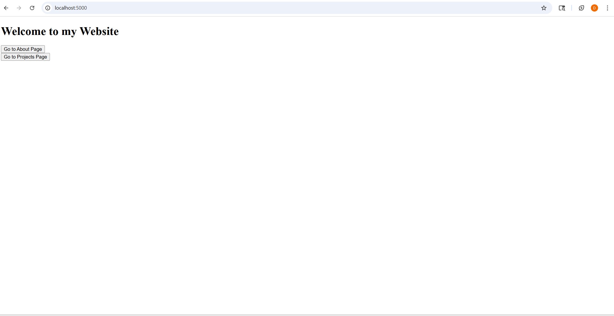
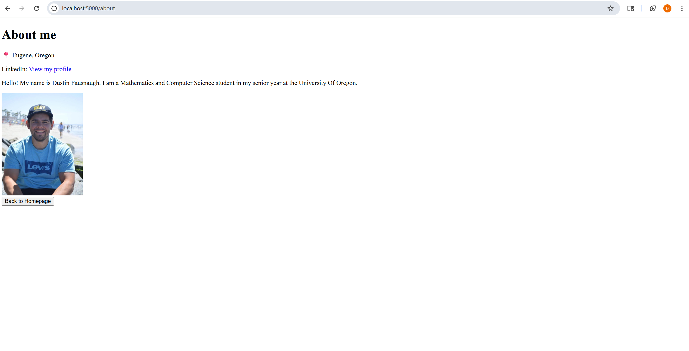
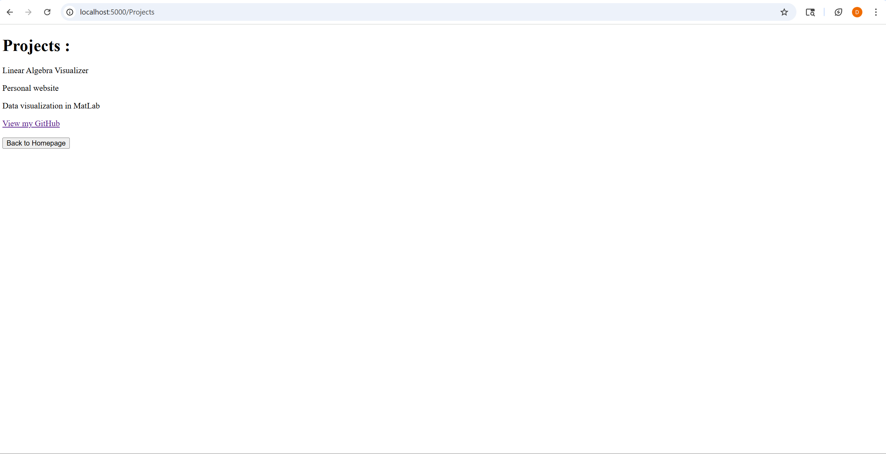

# Personal Website - Dustin Fausnaugh

This is my personal website built with **Flask**, showcasing my profile, projects, and contact infromation.

## Installation and Execution

### Download and install the latest version of Python

### Install requirements.txt
```
pip install -r requirements.txt
```
### Run app.py from the root directory
```
python app.py
```
### Open your browser and visit:
```
http://127.0.0.1:5000/
```
### Project Structure
```
/templates      - HTML templates
/static         - CSS, images, and JS files
app.py          - Flask application
requirements.txt
README.md
```
### Screenshots of Webpage





